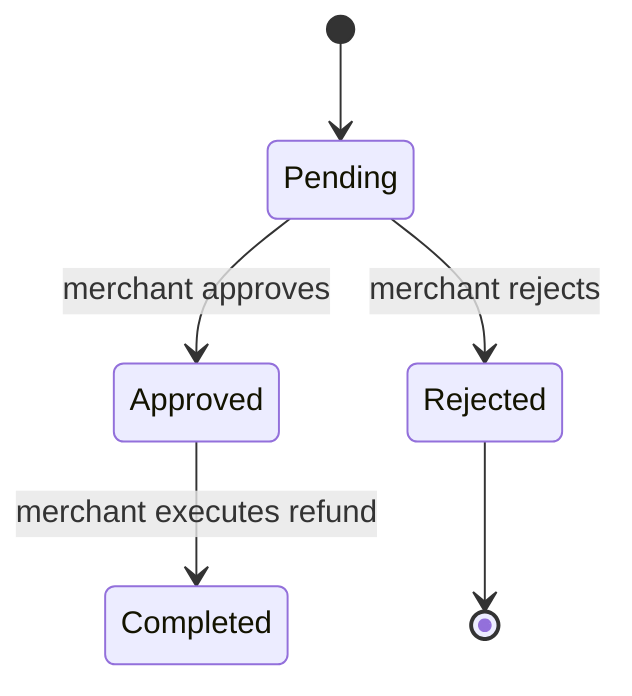

# LumenFlow

**Scalable, secure, and decentralized smart contracts for Soroban on Stellar.**

[](https://github.com/Gloriachinedu/lumenflow-contracts/actions/workflows/ci.yml)
[](LICENSE)
[](https://soroban.stellar.org)
[](docs/audit/audit-report.md)
[](https://discord.gg/lumenflow)

[English](README.md) | [Español](README.es.md) | [Português](README.pt.md)

---

## Overview

LumenFlow is a production-grade payment processing smart contract for the [Stellar Soroban](https://soroban.stellar.org) network. It provides:

- **Merchant management** — registration, profiles, deactivation
- **Payment processing** — ed25519 signature-verified token transfers
- **Refund lifecycle** — initiate → approve/reject → execute
- **Multi-signature payments** — configurable threshold approvals
- **Payment history queries** — paginated, filtered, and sorted
- **Admin controls** — global stats, archiving, automated cleanup

## Security & Docs

- Architecture overview available in [`docs/ARCHITECTURE.md`](docs/ARCHITECTURE.md)
- Audit plan and scope published in `docs/audit/audit-report.md`
- Refund lifecycle state diagram available in `docs/refund-lifecycle.md`
- Testing guidance available in `docs/testing-guide.md`
- Multisig payment flow guide available in `docs/multisig-guide.md`
- Secrets and secure local environment setup in [`docs/secrets-and-local-env.md`](docs/secrets-and-local-env.md)

## Refund lifecycle overview



## Notes

This contract uses saturating accumulation for global payment and refund volumes to prevent runtime panics in release mode.

---

## Prerequisites

| Tool | Install |
|------|---------|
| Rust (stable) | https://rustup.rs |
| Stellar CLI | https://developers.stellar.org/docs/tools/stellar-cli |
| Docker Desktop (local network) | https://www.docker.com/products/docker-desktop |

Verify:

```bash
rustc --version
cargo --version
stellar --version
docker --version
```

Add the WASM target:

```bash
rustup target add wasm32-unknown-unknown
```

---

## Project Structure

```
lumenflow-contracts/
├── contracts/
│   └── lumenflow/
│       ├── Cargo.toml
│       └── src/
│           ├── lib.rs        # Contract entry points
│           ├── types.rs      # Data structures
│           ├── storage.rs    # Persistent storage helpers
│           ├── error.rs      # Typed error codes
│           ├── helper.rs     # Auth & validation utilities
│           └── test.rs       # Unit tests
├── scripts/
│   ├── deploy.sh             # Build + deploy helper
│   └── test.sh               # Lint + test runner
├── cli/
│   └── lumenflow-cli/        # CLI tool and config loader
├── .github/
│   ├── workflows/
│   │   ├── ci.yml            # Lint, test, WASM build
│   │   └── release.yml       # Tag-triggered release
│   ├── ISSUE_TEMPLATE/
│   └── PULL_REQUEST_TEMPLATE.md
├── Cargo.toml                # Workspace manifest
├── rust-toolchain.toml
├── CHANGELOG.md
├── CONTRIBUTING.md
├── LICENSE
└── SECURITY.md
```

## CLI Usage

The `lumenflow` CLI provides quick access to common contract workflows such as payments, refunds, history queries, and admin statistics.

### Configuration

The CLI loads configuration from a `.lumenflow.toml` file by default, and environment variables override values from the file. The CLI also loads a `.env` file if present.

Example `.lumenflow.toml`:

```toml
network = "testnet"
contract_id = "GC..."
source_account = "S..."
```

Supported environment variables:

- `LUMENFLOW_NETWORK` — Stellar network (`local`, `testnet`, `mainnet`)
- `LUMENFLOW_CONTRACT_ID` — deployed contract ID
- `LUMENFLOW_SOURCE` — source account secret key used for CLI commands

You can also pass a custom config file path with `--config`.

### Pay

```bash
lumenflow pay --merchant G... --amount 1000 --order_id ORDER_001
```

### Refund

```bash
lumenflow refund init --order_id ORDER_001 --amount 500
```

### History

```bash
lumenflow history --merchant G...
```

### Stats

```bash
lumenflow stats
```

## Merchant Onboarding

New merchants can register through the following flow:

1. **Connect Wallet**: Ensure your Stellar wallet is connected.
2. **Check Registration**: Call `is_registered(address)` to check if you already have a profile.
3. **Register**: Call `register_merchant` with your business details and category.
4. **Verification**: Upon success, you will be redirected to the dashboard where you can start accepting payments.

Existing profiles can be retrieved using `get_merchant(address)`.

---

## Build

```bash
# From the workspace root
cargo build --target wasm32-unknown-unknown --release --package lumenflow
```

The compiled WASM is at:

```
target/wasm32-unknown-unknown/release/lumenflow.wasm
```

**Current binary size:** ~55 KB (well within Soroban's 128 KB contract size limit).

CI enforces a 100 KB threshold — the build fails if the WASM exceeds this size. To check locally:

```bash
wc -c target/wasm32-unknown-unknown/release/lumenflow.wasm
```

---

## Testing

```bash
# Run all tests
cargo test --all-features

# Run a specific test
cargo test test_successful_refund_flow

# Full lint + test pipeline
./scripts/test.sh
```

## Benchmarking

Performance benchmarks for contract hot paths are available in [`contracts/lumenflow/benches/benchmark.rs`](contracts/lumenflow/benches/benchmark.rs) and documented in [`docs/benchmarking.md`](docs/benchmarking.md).

```bash
cargo bench --manifest-path contracts/lumenflow/Cargo.toml
```

The benchmark harness reports relative runtime for:

- `process_payment_with_signature`
- merchant payment history queries
- `cleanup_expired_payments`

Benchmark results help identify optimization targets and compare the cost of hot-path operations.

## Code Coverage

Install `cargo-llvm-cov` once:

```bash
cargo install cargo-llvm-cov
rustup component add llvm-tools-preview
```

Generate a local HTML report:

```bash
COVERAGE=1 ./scripts/test.sh
# Report: coverage/index.html
# lcov data: lcov.info
```

CI enforces a minimum **80% line coverage** threshold and uploads both the HTML report and `lcov.info` as build artifacts.

Test coverage includes:

- Merchant registration and deactivation
- Payment processing with signature verification
- Duplicate order ID rejection
- Refund initiation, approval, rejection, and execution
- Refund window and amount validation
- Multi-signature payment threshold enforcement
- Paginated history queries with filters and sorting
- Global statistics tracking
- Payment cleanup by age

---

## Local Network Setup

A `docker-compose.yml` is provided to spin up a local Stellar node with Soroban RPC enabled.

```bash
# Validate the compose file before starting the local node
docker compose -f docker-compose.yml config

# 1. Start the local node and deploy the contract in one step
SOURCE_ACCOUNT=<secret-key> ./scripts/local_up.sh

# 2. Initialise admin (use the CONTRACT_ID printed by the script)
stellar contract invoke \
  --id <CONTRACT_ID> \
  --source-account <admin-secret-key> \
  --rpc-url http://localhost:8000/soroban/rpc \
  --network-passphrase "Standalone Network ; February 2017" \
  -- set_admin \
  --admin <admin-address>

# Stop the node when done
docker compose down
```

Secrets and local credentials should never be committed to the repository. Use environment variables or local `.env` files, and keep `.env.example` as the only example configuration file in source control.

Works on Linux and macOS (requires Docker Desktop or Docker Engine with Compose v2).

---

## Smoke Test

The smoke test script validates that the deployed contract is functional by exercising the admin initialization, merchant registration, payment path, and merchant retrieval.

### Run the smoke test

```bash
CONTRACT_ID=<contract-id> \
ADMIN_KEY=<admin-secret> \
MERCHANT_KEY=<merchant-secret> \
PAYER_KEY=<payer-secret> \
TOKEN_ADDRESS=<token-address> \
ADMIN_ADDRESS=<admin-address> \
MERCHANT_ADDRESS=<merchant-address> \
PAYER_ADDRESS=<payer-address> \
NETWORK=testnet \
./scripts/smoke_test.sh
```

### Required environment variables

- `CONTRACT_ID` — deployed contract ID
- `ADMIN_KEY` — admin account secret key
- `MERCHANT_KEY` — merchant account secret key
- `PAYER_KEY` — payer account secret key
- `TOKEN_ADDRESS` — testnet SAC token address used for payment
- `ADMIN_ADDRESS` — admin public address
- `MERCHANT_ADDRESS` — merchant public address
- `PAYER_ADDRESS` — payer public address
- `NETWORK` — target network (`testnet` by default)

Optional values supported by the smoke script:

- `SMOKE_SIG` — explicit signature bytes for `process_payment_with_signature`
- `SMOKE_PUBKEY` — explicit merchant public key used inside the test

### Expected success criteria

The smoke test passes when each step succeeds without returning a non-zero exit code. It executes:

1. `set_admin`
2. `register_merchant`
3. `process_payment_with_signature`
4. `get_merchant`

On success, the script prints:

```text
✅ Smoke test passed.
```

### GitHub Actions secrets

To run the smoke test from GitHub Actions, set these repository secrets:

- `TESTNET_ADMIN_KEY`
- `TESTNET_MERCHANT_KEY`
- `TESTNET_PAYER_KEY`
- `TESTNET_TOKEN_ADDRESS`
- `TESTNET_ADMIN_ADDRESS`
- `TESTNET_MERCHANT_ADDRESS`
- `TESTNET_PAYER_ADDRESS`

---

## Contract API

For a complete list of contract error codes, their descriptions, and remediation steps, see **[docs/errors.md](docs/errors.md)**.

### Admin Configuration

```bash
# Set admin (one-time)
stellar contract invoke --id $CONTRACT_ID --source-account $ADMIN_KEY --network $NETWORK \
  -- set_admin --admin $ADMIN_ADDR

# Transfer admin rights
stellar contract invoke --id $CONTRACT_ID --source-account $ADMIN_KEY --network $NETWORK \
  -- transfer_admin --current_admin $ADMIN_ADDR --new_admin $NEW_ADMIN_ADDR

# Add allowed token (admin only)
stellar contract invoke --id $CONTRACT_ID --source-account $ADMIN_KEY --network $NETWORK \
  -- add_allowed_token --admin $ADMIN_ADDR --token $TOKEN_ADDR

# Remove allowed token (admin only)
stellar contract invoke --id $CONTRACT_ID --source-account $ADMIN_KEY --network $NETWORK \
  -- remove_allowed_token --admin $ADMIN_ADDR --token $TOKEN_ADDR

# Set platform fee (admin only)
stellar contract invoke --id $CONTRACT_ID --source-account $ADMIN_KEY --network $NETWORK \
  -- set_platform_fee --admin $ADMIN_ADDR --fee_bps 250 --fee_recipient $FEE_RECIPIENT_ADDR

# Set large payment threshold (admin only)
stellar contract invoke --id $CONTRACT_ID --source-account $ADMIN_KEY --network $NETWORK \
  -- set_large_payment_threshold --admin $ADMIN_ADDR --threshold 100000

# Set payment cleanup period (seconds)
stellar contract invoke --id $CONTRACT_ID --source-account $ADMIN_KEY --network $NETWORK \
  -- set_payment_cleanup_period --admin $ADMIN_ADDR --period 7776000

# Set multisig expiry duration (admin only)
stellar contract invoke --id $CONTRACT_ID --source-account $ADMIN_KEY --network $NETWORK \
  -- set_multisig_expiry_duration --admin $ADMIN_ADDR --duration 2592000

# Set refund window (admin only)
stellar contract invoke --id $CONTRACT_ID --source-account $ADMIN_KEY --network $NETWORK \
  -- set_refund_window --admin $ADMIN_ADDR --window_secs 2592000

# Set minimum refund amount (admin only)
stellar contract invoke --id $CONTRACT_ID --source-account $ADMIN_KEY --network $NETWORK \
  -- set_min_refund_amount --admin $ADMIN_ADDR --amount 100

# Pause the contract (admin only)
stellar contract invoke --id $CONTRACT_ID --source-account $ADMIN_KEY --network $NETWORK \
  -- pause_contract --admin $ADMIN_ADDR

# Unpause the contract (admin only)
stellar contract invoke --id $CONTRACT_ID --source-account $ADMIN_KEY --network $NETWORK \
  -- unpause_contract --admin $ADMIN_ADDR

# Get contract version
stellar contract invoke --id $CONTRACT_ID --source-account $CALLER_KEY --network $NETWORK \
  -- get_contract_version
```

### Merchant Management

```bash
# Check registration
stellar contract invoke --id $CONTRACT_ID --source-account $CALLER_KEY --network $NETWORK \
  -- is_registered --merchant_address $MERCHANT_ADDR

# Register
stellar contract invoke --id $CONTRACT_ID --source-account $MERCHANT_KEY --network $NETWORK \
  -- register_merchant \
  --merchant_address $MERCHANT_ADDR \
  --name "My Store" \
  --description "Store description" \
  --contact_info "contact@store.com" \
  --category Retail

# Update merchant profile
stellar contract invoke --id $CONTRACT_ID --source-account $MERCHANT_KEY --network $NETWORK \
  -- update_merchant \
  --merchant_address $MERCHANT_ADDR \
  --name "My Store Updated" \
  --description "Updated description" \
  --contact_info "support@store.com" \
  --category Retail

# Verify merchant (admin only)
stellar contract invoke --id $CONTRACT_ID --source-account $ADMIN_KEY --network $NETWORK \
  -- verify_merchant --admin $ADMIN_ADDR --merchant_address $MERCHANT_ADDR

# Unverify merchant (admin only)
stellar contract invoke --id $CONTRACT_ID --source-account $ADMIN_KEY --network $NETWORK \
  -- unverify_merchant --admin $ADMIN_ADDR --merchant_address $MERCHANT_ADDR

# Reactivate merchant (admin only)
stellar contract invoke --id $CONTRACT_ID --source-account $ADMIN_KEY --network $NETWORK \
  -- reactivate_merchant --admin $ADMIN_ADDR --merchant_address $MERCHANT_ADDR

# Deactivate merchant (admin only)
stellar contract invoke --id $CONTRACT_ID --source-account $ADMIN_KEY --network $NETWORK \
  -- deactivate_merchant --admin $ADMIN_ADDR --merchant_address $MERCHANT_ADDR

# Get merchant info
stellar contract invoke --id $CONTRACT_ID --source-account $CALLER_KEY --network $NETWORK \
  -- get_merchant --merchant_address $MERCHANT_ADDR

# List merchants (admin only, cursor-based pagination)
stellar contract invoke --id $CONTRACT_ID --source-account $ADMIN_KEY --network $NETWORK \
  -- get_merchants --admin $ADMIN_ADDR --cursor null --limit 10
```

### Payment Processing

For detailed information on the signature payload format and how to build it in various languages, see **[docs/signature-format.md](docs/signature-format.md)**.

```bash
# Process payment with signature
stellar contract invoke --id $CONTRACT_ID --source-account $PAYER_KEY --network $NETWORK \
  -- process_payment_with_signature \
  --payer $PAYER_ADDR \
  --order_id "ORDER_001" \
  --merchant_address $MERCHANT_ADDR \
  --token_address $TOKEN_ADDR \
  --amount 1000 \
  --memo "Invoice #001" \
  --tags null \
  --signature "<64-byte-signature>" \
  --merchant_public_key "<32-byte-public-key>"

# Batch payment (atomic, up to 10 items)
stellar contract invoke --id $CONTRACT_ID --source-account $PAYER_KEY --network $NETWORK \
  -- batch_payment \
  --payments '[{"order_id":"ORDER_002","merchant_address":"$MERCHANT_ADDR","token_address":"$TOKEN_ADDR","amount":500,"memo":"Batch item 1","tags":null,"signature":"<64-byte-signature>","merchant_public_key":"<32-byte-public-key>"}]'

# Get payment by ID
stellar contract invoke --id $CONTRACT_ID --source-account $CALLER_KEY --network $NETWORK \
  -- get_payment_by_id --caller $CALLER_ADDR --order_id "ORDER_001"

# Get payment summary (public)
stellar contract invoke --id $CONTRACT_ID --source-account $CALLER_KEY --network $NETWORK \
  -- get_payment_summary --order_id "ORDER_001"

# Update payment status after a refund (merchant or admin)
stellar contract invoke --id $CONTRACT_ID --source-account $MERCHANT_KEY --network $NETWORK \
  -- update_payment_status \
  --caller $MERCHANT_ADDR \
  --order_id "ORDER_001" \
  --refunded_amount 500

# Archive payment (admin only)
stellar contract invoke --id $CONTRACT_ID --source-account $ADMIN_KEY --network $NETWORK \
  -- archive_payment_record --admin $ADMIN_ADDR --order_id "ORDER_001"

# Cleanup expired payments (admin only)
stellar contract invoke --id $CONTRACT_ID --source-account $ADMIN_KEY --network $NETWORK \
  -- cleanup_expired_payments --admin $ADMIN_ADDR
```

### Payment Requests

```bash
# Create a payment request
stellar contract invoke --id $CONTRACT_ID --source-account $MERCHANT_KEY --network $NETWORK \
  -- create_payment_request \
  --merchant $MERCHANT_ADDR \
  --request_id "REQ_001" \
  --token_address $TOKEN_ADDR \
  --amount 2500 \
  --memo "Invoice request" \
  --ttl 86400

# Pay a payment request
stellar contract invoke --id $CONTRACT_ID --source-account $PAYER_KEY --network $NETWORK \
  -- pay_payment_request --payer $PAYER_ADDR --request_id "REQ_001"
```

### Payment History Queries

```bash
# Merchant history (paginated, sorted by date descending)
stellar contract invoke --id $CONTRACT_ID --source-account $MERCHANT_KEY --network $NETWORK \
  -- get_merchant_payment_history \
  --merchant <merchant-address> \
  --cursor null \
  --limit 10 \
  --filter null \
  --sort_field Date \
  --sort_order Descending

# Payer history with amount filter
stellar contract invoke --id $CONTRACT_ID --source-account $PAYER_KEY --network $NETWORK \
  -- get_payer_payment_history \
  --payer <payer-address> \
  --cursor null \
  --limit 10 \
  --filter '{"amount_min":100,"amount_max":5000,"status":"Any"}' \
  --sort_field Amount \
  --sort_order Ascending

# Global stats (admin only)
stellar contract invoke --id $CONTRACT_ID --source-account $ADMIN_KEY --network $NETWORK \
  -- get_global_payment_stats \
  --admin $ADMIN_ADDR \
  --date_start null \
  --date_end null

# Merchant stats (merchant only)
stellar contract invoke --id $CONTRACT_ID --source-account $MERCHANT_KEY --network $NETWORK \
  -- get_merchant_stats --merchant $MERCHANT_ADDR
```

**Filter fields:** `date_start`, `date_end`, `amount_min`, `amount_max`, `token`, `status` (`Any` | `Completed` | `PartiallyRefunded` | `FullyRefunded`)

**Sort fields:** `Date` | `Amount`  
**Sort orders:** `Ascending` | `Descending`  
**Pagination:** cursor-based using `order_id`; max 100 results per page.

`PaymentPage` response fields:
- `payments`: records returned for the current page
- `next_cursor`: cursor to request the next page (or `null` if none)
- `total_matching`: total count of records that match the query before applying `limit`

### Refunds

Refund rules:
- Window: 30 days from `paid_at`
- Minimum refund amount: 100 stroops by default (admin-configurable via `set_min_refund_amount`)
- Partial refunds allowed; cumulative total cannot exceed original amount
- Initiator: payer or merchant
- Approver/Rejector: merchant or admin
- Executor: merchant (signs the token transfer)

```bash
# Initiate
stellar contract invoke --id $CONTRACT_ID --source-account $CALLER_KEY --network $NETWORK \
  -- initiate_refund \
  --caller <caller-address> \
  --refund_id "REFUND_001" \
  --order_id "ORDER_001" \
  --amount 500 \
  --reason "Customer request"

# Approve
stellar contract invoke --id $CONTRACT_ID --source-account $MERCHANT_KEY --network $NETWORK \
  -- approve_refund --caller <merchant-address> --refund_id "REFUND_001"

# Reject
stellar contract invoke --id $CONTRACT_ID --source-account $MERCHANT_KEY --network $NETWORK \
  -- reject_refund --caller <merchant-address> --refund_id "REFUND_001"

# Execute (merchant signs the transfer)
stellar contract invoke --id $CONTRACT_ID --source-account $MERCHANT_KEY --network $NETWORK \
  -- execute_refund --refund_id "REFUND_001"

# Get refund status
stellar contract invoke --id $CONTRACT_ID --source-account $CALLER_KEY --network $NETWORK \
  -- get_refund --refund_id "REFUND_001"

# List all refunds for an order (payer, merchant, or admin only)
stellar contract invoke --id $CONTRACT_ID --source-account $CALLER_KEY --network $NETWORK \
  -- get_refunds_for_order --caller <caller-address> --order_id "ORDER_001"
```

### Multi-Signature Payments

```bash
# Initiate
stellar contract invoke --id $CONTRACT_ID --source-account $INITIATOR_KEY --network $NETWORK \
  -- initiate_multisig_payment \
  --initiator <initiator-address> \
  --payment_id "MS_001" \
  --merchant_address <merchant-address> \
  --token_address <token-address> \
  --amount 5000 \
  --signers '["<signer1>","<signer2>"]' \
  --required_signatures 2

# Sign
stellar contract invoke --id $CONTRACT_ID --source-account $SIGNER_KEY --network $NETWORK \
  -- sign_multisig_payment \
  --signer <signer-address> \
  --payment_id "MS_001" \
  --signature <signature-bytes>

# Execute (once threshold met)
stellar contract invoke --id $CONTRACT_ID --source-account $PAYER_KEY --network $NETWORK \
  -- execute_multisig_payment --payer <payer-address> --payment_id "MS_001"

# Cancel multisig payment (initiator or admin only)
stellar contract invoke --id $CONTRACT_ID --source-account $INITIATOR_KEY --network $NETWORK \
  -- cancel_multisig_payment \
  --caller $INITIATOR_ADDR \
  --payment_id "MS_001"

# Get multisig payment details
stellar contract invoke --id $CONTRACT_ID --source-account $SIGNER_KEY --network $NETWORK \
  -- get_multisig_payment \
  --caller $SIGNER_ADDR \
  --payment_id "MS_001"
```

---

## Events

Full event payload documentation and subscription guides can be found in [docs/events-reference.md](docs/events-reference.md).

For production monitoring — Horizon SSE streaming, alert thresholds, and example code — see [docs/monitoring.md](docs/monitoring.md).

| Event name | Trigger |
|---|---|
| `lumenflow/admin_set` | Admin initialised |
| `lumenflow/merchant_registered` | New merchant registered |
| `lumenflow/merchant_updated` | Merchant profile updated |
| `lumenflow/merchant_deactivated` | Merchant deactivated |
| `lumenflow/payment_processed` | Payment completed |
| `lumenflow/payment_archived` | Payment record removed |
| `lumenflow/refund_initiated` | Refund request opened |
| `lumenflow/refund_approved` | Refund approved |
| `lumenflow/refund_rejected` | Refund rejected |
| `lumenflow/refund_executed` | Refund transfer completed |
| `lumenflow/multisig_initiated` | Multisig payment created |
| `lumenflow/multisig_executed` | Multisig payment executed |
| `lumenflow/payment_request_paid` | Payment request completed |
| `lumenflow/suspicious_activity` | Safety threshold exceeded |

---

## Frontend Quickstart

The `frontend/` directory contains three standalone HTML pages that let you interact with LumenFlow without any build step.

| Page | File | Purpose |
|------|------|---------|
| Payment History | `frontend/history.html` | Browse and filter your payment records |
| Payment Receipt | `frontend/receipt.html` | View a receipt for a specific order |
| Multisig Payment | `frontend/multisig.html` | Initiate and sign multi-signature payments |

### Open locally

Simply open any file directly in a browser:

```bash
# Linux / macOS
xdg-open frontend/history.html   # Linux
open frontend/history.html        # macOS

# Or serve with any static server to avoid browser CORS restrictions
npx serve frontend
# then visit http://localhost:3000
```

### Demo mode vs live mode

By default the pages run in **demo mode** — they render with hard-coded mock data so you can preview the UI without a deployed contract.

To switch to **live mode**, set the following environment variables before serving the pages (or edit the `<script>` block at the top of each HTML file):

| Variable | Description | Example |
|----------|-------------|---------|
| `LUMENFLOW_CONTRACT_ID` | Deployed contract address | `CABC…XYZ` |
| `LUMENFLOW_NETWORK` | Stellar network to connect to | `testnet` or `mainnet` |
| `LUMENFLOW_RPC_URL` | Soroban RPC endpoint | `https://soroban-testnet.stellar.org` |

Example using a simple HTTP server with injected config:

```bash
export LUMENFLOW_CONTRACT_ID="CABC...XYZ"
export LUMENFLOW_NETWORK="testnet"
export LUMENFLOW_RPC_URL="https://soroban-testnet.stellar.org"
npx serve frontend
```

> **Note:** The pages connect to Stellar Freighter or a compatible browser wallet for transaction signing. Install the [Freighter extension](https://www.freighter.app/) before using live mode.

---

## Testnet Deployment

```bash
NETWORK=testnet SOURCE_ACCOUNT=<testnet-secret-key> ./scripts/deploy.sh
```

Get testnet XLM from the [Stellar Friendbot](https://friendbot.stellar.org).

---

## Troubleshooting

**WASM target missing:**
```bash
rustup target add wasm32-unknown-unknown
```

**Local network fails to start:**
```bash
stellar network container restart local
```

**Insufficient XLM for fees:** Fund your account via Friendbot (testnet) or acquire XLM (mainnet).

**Test failures:** Ensure `soroban-sdk` version in `Cargo.toml` matches `rust-toolchain.toml` channel.

---

## Community & Support

Need help or want to discuss LumenFlow?

- **Discord Server:** Join our [Discord community](https://discord.gg/lumenflow) to chat with developers and other users.
- **GitHub Discussions:** Ask questions and share ideas in [GitHub Discussions](https://github.com/Gloriachinedu/lumenflow-contracts/discussions).
- **Support Guidelines:** See [SUPPORT.md](SUPPORT.md) for details on where to get help and how to report bugs.

---

## Webhook / Off-Chain Notifications

Merchants can receive real-time payment event notifications in their backend systems via the Horizon event stream. See [docs/webhook-integration.md](docs/webhook-integration.md) for a full guide including a Node.js example server and idempotency best practices.

---

## Contributing

See [CONTRIBUTING.md](CONTRIBUTING.md). All contributions are welcome — bug fixes, features, documentation, and tests.

New contributors should start with the [Developer Onboarding Guide](docs/ONBOARDING.md).

## Governance

See [GOVERNANCE.md](GOVERNANCE.md) for project decision-making, the RFC process, and maintainer responsibilities.

## Localization and Translation

We maintain localized versions of the README to support Spanish and Portuguese readers. The translated files are:

- [README.es.md](README.es.md)
- [README.pt.md](README.pt.md)

### Translation workflow

1. Update the canonical `README.md` with new content or structural changes.
2. Notify translators and update the corresponding localized files.
3. Verify that key docs and examples are preserved in translations.
4. Keep translations synchronized by reviewing changes during each release or docs update.

### Prioritized documents for translation

1. `README.md` — primary project overview and getting started guide.
2. `SECURITY.md` — responsible disclosure and incident reporting.
3. `docs/events-reference.md` — event payload definitions and integrations.
4. `sdk/README.md` — SDK usage and helper method guidance.

## Security

See [SECURITY.md](SECURITY.md) for responsible disclosure instructions.

## License

[MIT](LICENSE) © 2026 LumenFlow Contributors
