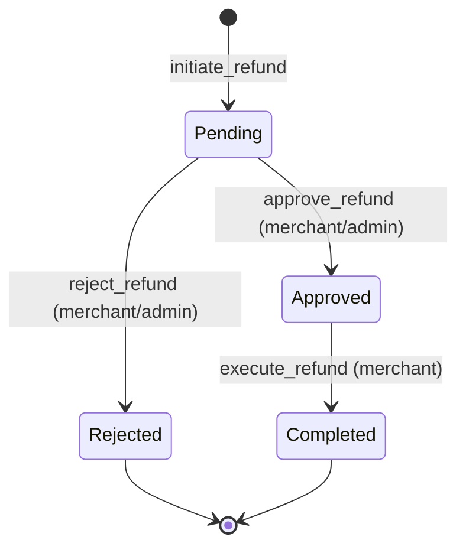
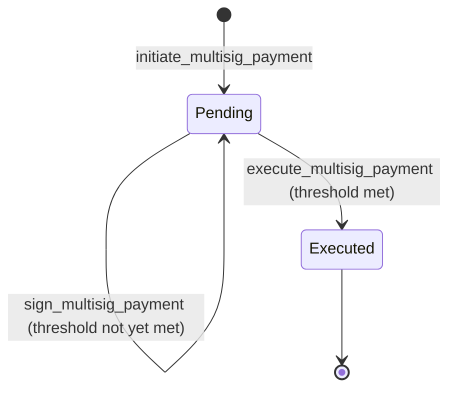

# LumenFlow Architecture

This document describes the internal structure of the LumenFlow Soroban smart contract: module responsibilities, storage layout, auth model, and lifecycle diagrams.

---

## Module Responsibilities

```
contracts/lumenflow/src/
├── lib.rs        — All contract entry points (public API)
├── types.rs      — Shared data structures and enums
├── storage.rs    — Typed wrappers around Soroban persistent/instance storage
├── error.rs      — PaymentError enum (all typed error codes)
└── helper.rs     — Auth checks and input validation utilities
```

### `lib.rs`
The single contract struct `PaymentProcessingContract`. Every `#[contractimpl]` function is defined here. Functions delegate to `storage.rs` for reads/writes and `helper.rs` for auth/validation. No business logic lives outside this file.

### `types.rs`
Defines all `#[contracttype]` structs and enums used in storage and function signatures:
- `MerchantProfile`, `MerchantCategory`
- `PaymentRecord`, `PaymentStatus`, `PaymentFilter`, `SortField`, `SortOrder`, `StatusFilter`
- `RefundRecord`, `RefundStatus`
- `MultisigPayment`, `MultisigStatus`
- `GlobalStats`, `PaymentPage`, `BatchPaymentItem`

### `storage.rs`
Typed get/set helpers for every storage key. Centralises all `env.storage()` calls so `lib.rs` never touches raw storage keys directly. Key categories:

| Helper prefix | Storage type | Purpose |
|---|---|---|
| `get/set_admin` | Instance | Admin address |
| `get/set_merchant` | Persistent | Merchant profiles |
| `get/set_payment` | Persistent | Payment records |
| `get/set_refund` | Persistent | Refund records |
| `get/set_multisig` | Persistent | Multisig payment state |
| `get/set_global_stats` | Instance | Aggregate counters |
| `get/set_merchant_index` | Persistent | Per-merchant order ID list |
| `get/set_payer_index` | Persistent | Per-payer order ID list |
| `get/set_payer_nonce` | Persistent | Replay-protection counter |

### `error.rs`
`PaymentError` — a `#[contracterror]` enum. Every function returns `Result<T, PaymentError>`. No panics in contract code.

### `helper.rs`
- `require_admin` — reads admin from storage, calls `env.require_auth`
- `validate_string_len` — enforces max-length constraints on memo/reason fields
- `validate_amount` — rejects zero or negative amounts

---

## Storage Layout

LumenFlow uses two Soroban storage tiers:

**Instance storage** (shared contract lifetime, cheaper):
- `Admin` → `Address`
- `GlobalStats` → `GlobalStats`
- `MaxRefundsPerOrder` → `u32`
- `LargePaymentThreshold` → `i128`
- `PaymentCleanupPeriod` → `u64`

**Persistent storage** (per-key TTL, survives ledger archival):
- `Merchant(Address)` → `MerchantProfile`
- `Payment(String)` → `PaymentRecord`  *(keyed by order_id)*
- `Refund(String)` → `RefundRecord`  *(keyed by refund_id)*
- `Multisig(String)` → `MultisigPayment`  *(keyed by payment_id)*
- `MerchantIndex(Address)` → `Vec<String>`  *(order IDs for history)*
- `PayerIndex(Address)` → `Vec<String>`  *(order IDs for history)*
- `PayerNonce(Address)` → `u64`
- `AllowedToken(Address)` → `bool`

---

## Auth Model

See also [`docs/auth-model.md`](auth-model.md) for full details.

| Operation | Required auth |
|---|---|
| `set_admin` | None (one-time, first caller) |
| `register_merchant` | `merchant_address` |
| `deactivate_merchant` | admin |
| `process_payment_with_signature` | `payer` |
| `initiate_refund` | `payer` or `merchant` |
| `approve_refund` / `reject_refund` | `merchant` or admin |
| `execute_refund` | merchant of the original payment |
| `initiate_multisig_payment` | `initiator` |
| `sign_multisig_payment` | `signer` (must be in signers list) |
| `execute_multisig_payment` | `payer` (initiator) |
| `get_global_payment_stats` | admin |
| `archive_payment_record` | admin |
| `cleanup_expired_payments` | admin |

Auth is enforced via `env.require_auth(&address)` inside `helper::require_admin` or inline in `lib.rs`. `mock_all_auths()` is used in tests to bypass Soroban's auth engine.

---

## Refund State Machine



Rules:
- Window: 30 days from `paid_at` timestamp
- Partial refunds allowed; cumulative total ≤ original amount
- Max concurrent refunds per order enforced by `MaxRefundsPerOrder` (default 5)
- Payment status transitions: `Completed` → `PartiallyRefunded` → `FullyRefunded`

---

## Multisig Payment Lifecycle



Rules:
- `signers` list and `required_signatures` threshold set at initiation
- Each signer calls `sign_multisig_payment` once; duplicate signing is rejected
- `execute_multisig_payment` fails with `InsufficientSignatures` if threshold not met
- On execution, a `PaymentRecord` is written and indexed in merchant/payer history

---

## Payment History Indexing

History queries are O(n) scans over in-contract index vectors:

1. `MerchantIndex(merchant)` and `PayerIndex(payer)` store ordered lists of `order_id` strings.
2. `get_merchant_payment_history` / `get_payer_payment_history` load the index, apply filters, sort, and paginate using cursor-based pagination (cursor = last seen `order_id`).
3. Max page size: 100 results.

---

## Replay Protection

`process_payment_with_nonce` uses a per-payer `PayerNonce` counter stored in persistent storage. The caller must supply the current nonce; the contract increments it on success. Mismatched nonces return `InvalidNonce`.

`process_payment_with_signature` uses `order_id` uniqueness (duplicate order IDs return `PaymentAlreadyExists`) combined with ed25519 signature verification over the payment payload.

---

## Event Emission

Every state-changing operation emits a Soroban event with topic `["lumenflow", "<event_name>"]`. See [`docs/events-reference.md`](events-reference.md) for full payload schemas.
