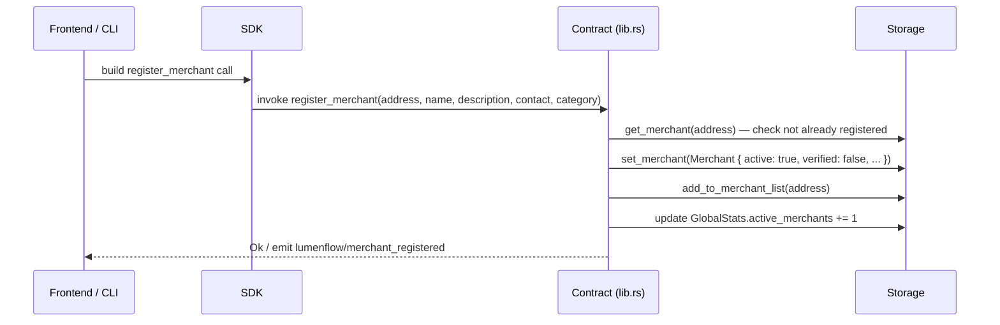
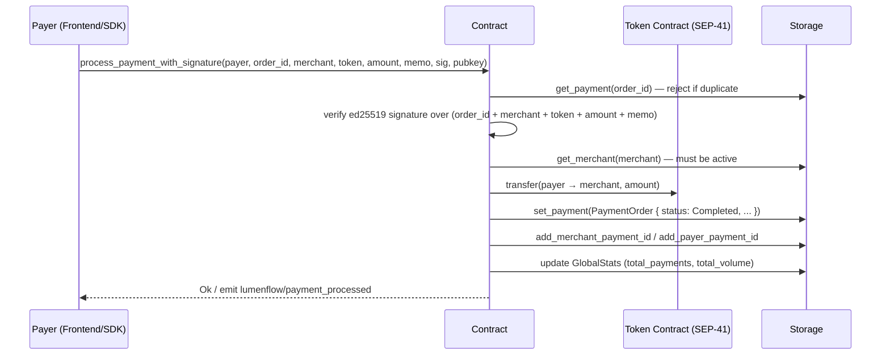
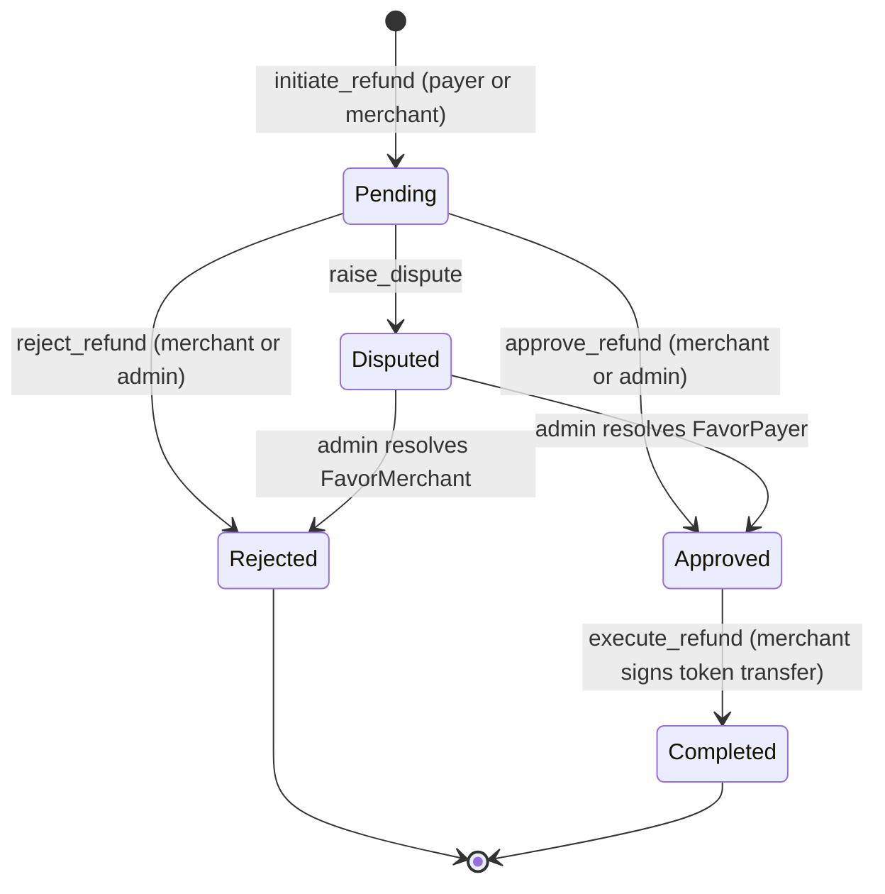
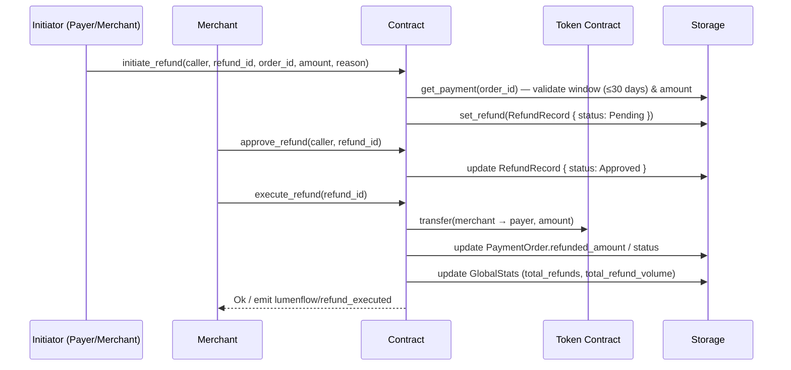

# LumenFlow Architecture

This document describes the high-level architecture of LumenFlow and the data flows between its main components.

---

## Component Overview

```
┌─────────────────────────────────────────────────────────────────┐
│                        Client Layer                             │
│                                                                 │
│   ┌──────────────────┐        ┌───────────────────────────┐    │
│   │  Frontend (HTML) │        │  CLI (lumenflow-cli)       │    │
│   │  frontend/       │        │  cli/lumenflow-cli/        │    │
│   └────────┬─────────┘        └────────────┬──────────────┘    │
│            │                               │                    │
│            └──────────────┬────────────────┘                    │
│                           │  TypeScript SDK                     │
│                   ┌───────┴──────────┐                          │
│                   │  sdk/src/        │                          │
│                   │  signPayment,    │                          │
│                   │  wallet, errors  │                          │
│                   └───────┬──────────┘                          │
└───────────────────────────┼─────────────────────────────────────┘
                            │  Stellar RPC / Horizon
                            ▼
┌───────────────────────────────────────────────────────────────┐
│                   Soroban Smart Contract                       │
│                   contracts/lumenflow/src/                     │
│                                                                │
│  lib.rs ──► types.rs ──► storage.rs                           │
│     │                       │                                  │
│     └──► helper.rs          └──► Persistent / Instance /      │
│     └──► error.rs                Temporary storage            │
└───────────────────────────────────────────────────────────────┘
```

### Component Roles

| Component | Location | Role |
|---|---|---|
| Frontend | `frontend/` | HTML UI for payments, multisig, and history |
| Dashboard | `dashboard/` | Merchant-facing portal and stats |
| SDK | `sdk/src/` | TypeScript helpers — payload signing, wallet connection, error types |
| CLI | `cli/lumenflow-cli/` | Command-line invoker for contract functions |
| Contract | `contracts/lumenflow/src/` | Core on-chain logic (Soroban/Rust) |
| CI/CD | `.github/workflows/` | Lint, test, WASM build, size checks, testnet deploy |
| Scripts | `scripts/` | Local network setup, deploy, smoke tests |

---

## Merchant Registration Flow



---

## Payment Processing Flow



---

## Refund Lifecycle Flow





---

## Multi-Signature Payment Flow

```mermaid
sequenceDiagram
    participant I as Initiator
    participant S1 as Signer 1
    participant S2 as Signer N
    participant C as Contract
    participant T as Token Contract
    participant St as Storage

    I->>C: initiate_multisig_payment(initiator, payment_id, merchant, token, amount, signers[], required_signatures)
    C->>St: set_multisig(MultisigPayment { executed: false, signatures: [], signed_by: [] })
    C-->>I: emit lumenflow/multisig_initiated

    S1->>C: sign_multisig_payment(signer, payment_id, signature)
    C->>St: append signature + signer address; verify signer is in signers[]

    S2->>C: sign_multisig_payment(signer, payment_id, signature)
    C->>St: append signature + signer address

    I->>C: execute_multisig_payment(payer, payment_id)
    C->>St: get_multisig — verify signatures.len() >= required_signatures
    C->>T: transfer(payer → merchant, amount)
    C->>St: update MultisigPayment { executed: true }
    C-->>I: emit lumenflow/multisig_executed
```

---

## Replay Protection and Nonce Model

Each payer has an associated `PayerNonce` (u64) stored in contract persistent storage.

- Payments submitted via `process_payment_with_nonce` must supply the expected current nonce value.
- On successful processing the contract increments the payer's nonce by 1.
- If the supplied nonce does not match the stored value, the contract rejects with `InvalidNonce`.

This design is necessary because Soroban does not provide a universal per-account sequence number at the contract entrypoint level. An on-chain per-payer counter provides deterministic replay protection tied to the payer's address.

Tests: see `contracts/lumenflow/src/test.rs` for integration tests that verify nonce increment and replay rejection.

---

## Storage Layout

| Key | Type | Tier | Description |
|---|---|---|---|
| `Admin` | `Address` | Instance | Contract administrator |
| `GlobalStats` | `GlobalStats` | Instance | Aggregate counters |
| `MerchantList` | `Vec<Address>` | Instance | All registered merchant addresses |
| `CleanupPeriod` | `u64` | Instance | Payment expiry window (seconds) |
| `Merchant(addr)` | `Merchant` | Persistent | Per-merchant profile |
| `Payment(id)` | `PaymentOrder` | Persistent | Per-payment record |
| `MerchantPayments(addr)` | `Vec<String>` | Persistent | Payment IDs for a merchant |
| `PayerPayments(addr)` | `Vec<String>` | Persistent | Payment IDs for a payer |
| `Refund(id)` | `RefundRecord` | Persistent | Per-refund record |
| `Multisig(id)` | `MultisigPayment` | Persistent | Per-multisig payment |
| `PaymentRequest(id)` | `PaymentRequest` | Temporary | Short-lived payment request |
