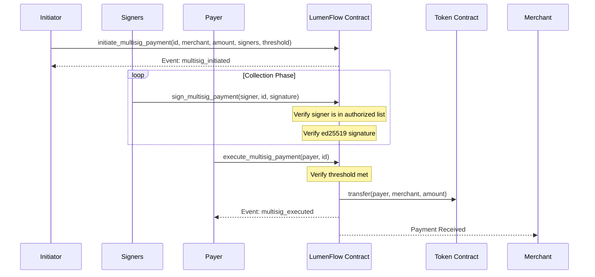

# Multisig Payment Flow Guide

LumenFlow supports multi-signature (multisig) payments, allowing for secure transactions that require approval from multiple parties before execution. This is ideal for corporate treasuries, escrow-like arrangements, or high-value transfers requiring dual control.

## Use Cases

- **Corporate Governance:** Require both a CFO and a Treasury Manager to sign off on large vendor payments.
- **Escrow Services:** A buyer, seller, and a neutral third-party arbitrator. A payment is executed only if two out of three parties sign.
- **Joint Accounts:** Spouses or business partners requiring both to approve a shared expense.
- **Enhanced Security:** Distributing signatures across different devices or wallets to prevent a single point of failure.

## The Multisig Lifecycle

The multisig flow in LumenFlow consists of three main phases: **Initiation**, **Collection**, and **Execution**.

### 1. Initiation
One party (the initiator) creates the multisig payment record. They define the merchant, token, amount, the list of authorized signers, and the threshold (required signatures).

### 2. Collection
Authorized signers add their signatures to the payment record. Each signature is verified against the signer's public key (ed25519).

### 3. Execution
Once the number of collected signatures reaches the `required_signatures` threshold, the payment can be executed. This triggers the actual token transfer from the payer to the merchant.

## Sequence Diagram



## Choosing `required_signatures`

The `required_signatures` parameter (threshold) should be chosen based on your trust model:

| Configuration | Trust Model | Security Level |
|---------------|-------------|----------------|
| **1 of N**    | Any one authorized person can pay. | Low (Any key compromise is critical) |
| **M of N**    | Majority or subset must agree. | Medium/High (Robust against some key loss/compromise) |
| **N of N**    | Unanimous consent required. | Very High (Safest, but vulnerable to any single key loss) |

**Recommendation:** For most business use cases, a **2-of-3** or **3-of-5** setup provides a good balance between security and availability.

## Security Considerations

1. **Signer List Immutability:** Once a multisig payment is initiated, the list of authorized signers and the threshold cannot be changed.
2. **Signature Replay Protection:** Signatures are specific to the `payment_id`. Ensure `payment_id` is unique across all transactions.
3. **Expiration:** Unlike standard payments, multisig payments remain in `Pending` state until executed or archived by an admin. Ensure you have a process to monitor and complete pending multisigs.
4. **Auth Requirements:**
   - `initiate_multisig_payment`: Requires `initiator` auth.
   - `sign_multisig_payment`: Requires `signer` auth.
   - `execute_multisig_payment`: Requires `payer` auth.

## CLI Example

```bash
# 1. Initiate (2-of-2)
stellar contract invoke --id $CONTRACT_ID --source-account $INITIATOR --network testnet \
  -- initiate_multisig_payment \
  --initiator $INITIATOR_ADDR \
  --payment_id "MS_X" \
  --merchant_address $MERCHANT_ADDR \
  --token_address $TOKEN_ADDR \
  --amount 5000 \
  --signers '["'$SIGNER1_ADDR'", "'$SIGNER2_ADDR'"]' \
  --required_signatures 2

# 2. Sign (Signer 1)
stellar contract invoke --id $CONTRACT_ID --source-account $SIGNER1 --network testnet \
  -- sign_multisig_payment \
  --signer $SIGNER1_ADDR \
  --payment_id "MS_X" \
  --signature <sig1-bytes>

# 3. Sign (Signer 2)
stellar contract invoke --id $CONTRACT_ID --source-account $SIGNER2 --network testnet \
  -- sign_multisig_payment \
  --signer $SIGNER2_ADDR \
  --payment_id "MS_X" \
  --signature <sig2-bytes>

# 4. Execute
stellar contract invoke --id $CONTRACT_ID --source-account $PAYER --network testnet \
  -- execute_multisig_payment --payer $PAYER_ADDR --payment_id "MS_X"
```
