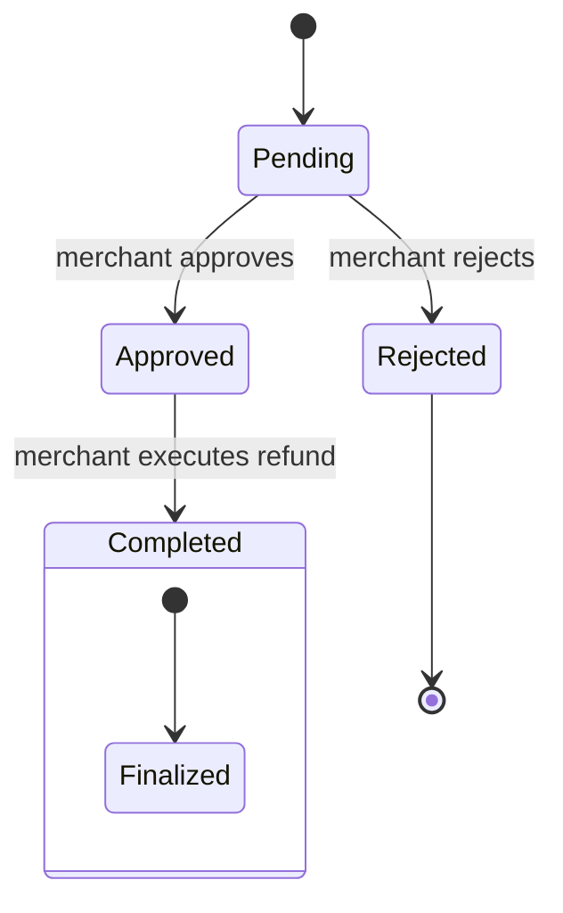

# Refund Lifecycle

## State Diagram

## Valid transitions

- `Pending` → `Approved`
  - Triggered by the merchant via `approve_refund`
  - Requires refund status to be `Pending`

- `Pending` → `Rejected`
  - Triggered by the merchant via `reject_refund`
  - Requires refund status to be `Pending`

- `Approved` → `Completed`
  - Triggered by the merchant via `execute_refund`
  - Requires refund status to be `Approved`

## Invalid transitions

- `Approved` → `Pending`
- `Completed` → any other state
- `Rejected` → any other state
- `Pending` → `Completed` without prior approval

## Error handling

- `approve_refund` or `reject_refund` called when refund is not `Pending` returns `RefundAlreadyCompleted`
- `execute_refund` called when refund is not `Approved` returns `RefundNotApproved`
- Executing a refund updates the related payment status and records the refund as `Completed`
