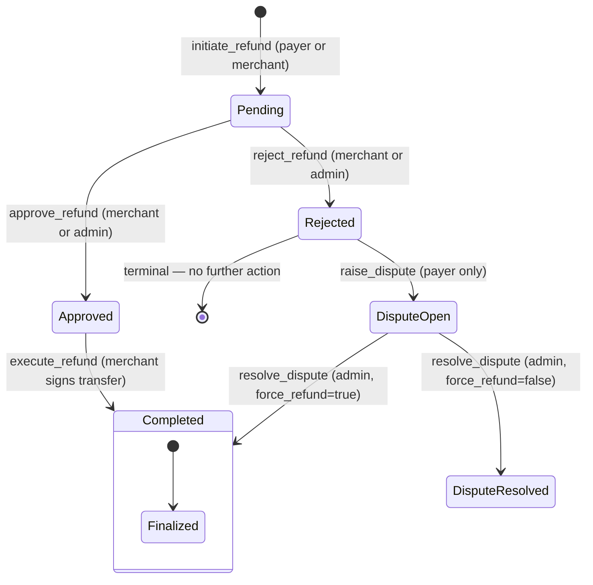

# Refund Lifecycle

Complete reference for the LumenFlow refund system: state machine, timing
constraints, terminal conditions, permission model, error catalogue, emitted
events, and boundary/edge cases.

> **See also:** [`docs/errors.md`](errors.md) for the full error code reference,
> [`docs/api-reference.md`](api-reference.md) for complete function signatures,
> and [`docs/access-control.md`](access-control.md) for the broader permission model.

---

## Table of Contents

1. [RefundRecord Data Model](#1-refundrecord-data-model)
2. [RefundStatus State Machine](#2-refundstatus-state-machine)
3. [Valid and Invalid Transitions](#3-valid-and-invalid-transitions)
4. [Terminal States](#4-terminal-states)
5. [Timing Constraints](#5-timing-constraints)
6. [Storage TTL](#6-storage-ttl)
7. [Permission Matrix](#7-permission-matrix)
8. [Function Reference](#8-function-reference)
9. [Error Catalogue](#9-error-catalogue)
10. [Event Catalogue](#10-event-catalogue)
11. [Boundary and Edge Cases](#11-boundary-and-edge-cases)
12. [Dispute Resolution](#12-dispute-resolution)

---

## 1. RefundRecord Data Model

Every refund is stored on-chain as a `RefundRecord`. The fields are:

| Field | Type | Description |
|-------|------|-------------|
| `refund_id` | `String` | Globally unique identifier for this refund (max 64 chars). Caller-chosen; must be non-empty and not previously used. |
| `order_id` | `String` | Identifier of the original `PaymentOrder` being refunded. |
| `initiator` | `Address` | Address that called `initiate_refund` (payer or merchant). |
| `amount` | `i128` | Token amount (in stroops) requested for this refund. Must be ≥ `MIN_REFUND_AMOUNT` (default 100 stroops). |
| `reason` | `String` | Human-readable justification; maximum 256 characters. |
| `status` | `RefundStatus` | Current lifecycle state: `Pending`, `Approved`, `Rejected`, or `Completed`. |
| `created_at` | `u64` | Unix timestamp (seconds) when the refund was initiated. |

> **Note:** There is no `updated_at` field. Use the on-chain event log to
> reconstruct the full history of status transitions for a given `refund_id`.

---

## 2. RefundStatus State Machine


```mermaid
stateDiagram-v2
    [*] --> Pending : initiate_refund (payer or merchant)
    Pending --> Approved : approve_refund (merchant or admin)
    Pending --> Rejected : reject_refund (merchant or admin)
    Approved --> Completed : execute_refund (merchant signs transfer)
    Rejected --> [*] : terminal — no further action
    Rejected --> DisputeOpen : raise_dispute (payer only)
    DisputeOpen --> DisputeResolved : resolve_dispute (admin, force_refund=false)
    DisputeOpen --> Completed : resolve_dispute (admin, force_refund=true)

    state Completed {
        [*] --> Finalized
    }
```

### State descriptions

| State | Meaning | Mutable? |
|-------|---------|----------|
| `Pending` | Refund has been requested; awaiting merchant or admin decision. | Yes |
| `Approved` | Merchant or admin accepted the request; ready for execution. | Yes |
| `Rejected` | Merchant or admin denied the request. Terminal unless the payer raises a dispute. | Conditionally terminal |
| `Completed` | Token transfer to payer has been executed. Fully terminal. | No |

---

## 3. Valid and Invalid Transitions

### Valid transitions

| From | To | Triggered by | Function |
|------|----|-------------|----------|
| `Pending` | `Approved` | Merchant or admin approves | `approve_refund` |
| `Pending` | `Rejected` | Merchant or admin rejects | `reject_refund` |
| `Approved` | `Completed` | Merchant signs token transfer | `execute_refund` |
| `Rejected` | *(dispute opened)* | Payer escalates | `raise_dispute` → creates `DisputeRecord` |
| *(dispute open)* | `Completed` | Admin force-resolves | `resolve_dispute(force_refund=true)` |

### Invalid transitions

The following transitions are **rejected by the contract** and return the error
listed:

| Attempted transition | Error returned |
|---------------------|---------------|
| `Approved` → `Pending` | `RefundAlreadyCompleted` (35) |
| `Rejected` → `Pending` | `RefundAlreadyCompleted` (35) |
| `Completed` → any | `RefundAlreadyCompleted` (35) |
| `Pending` → `Completed` (skip approval) | `RefundNotApproved` (34) |
| `Approved` → `Approved` (double-approve) | `RefundAlreadyCompleted` (35) |
| `Rejected` → `Approved` (without dispute path) | `RefundAlreadyCompleted` (35) |

`RefundAlreadyCompleted` is used for **any** attempt to mutate a refund that is
not in the expected state, including `Approved` and `Rejected` records — not
only truly completed ones. The name reflects the general "already past this
stage" semantics.

---

## 4. Terminal States

A refund in a terminal state cannot advance further through the refund state
machine.

| State | Terminal? | Notes |
|-------|-----------|-------|
| `Pending` | No | Awaits `approve_refund` or `reject_refund`. |
| `Approved` | No | Awaits `execute_refund`. |
| `Rejected` | **Conditionally terminal** | Terminal unless the payer opens a dispute via `raise_dispute`. Once a dispute is resolved without a forced refund (`force_refund=false`), the `Rejected` state is permanent. |
| `Completed` | **Unconditionally terminal** | The token transfer has occurred. No further transitions are possible. The record is kept on-chain for the TTL window (see section 6). |

### What "terminal" means operationally

- No further `approve_refund`, `reject_refund`, or `execute_refund` calls will
  succeed on a `Completed` refund.
- The associated payment's `refunded_amount` and `status` have already been
  updated and cannot be decremented.
- Global and per-merchant stats have been incremented and are not reversed.
- If additional funds need to be returned after a `Completed` refund, a **new
  separate refund** must be initiated (subject to the per-payment refund limit
  of 10 and the cumulative amount cap).

---

## 5. Timing Constraints

### Refund window

| Parameter | Default | Admin-configurable |
|-----------|---------|-------------------|
| `DEFAULT_REFUND_WINDOW_SECS` | 2 592 000 s (30 days) | Yes, via `set_refund_window` |
| `MIN_REFUND_WINDOW_SECS` | 3 600 s (1 hour) | Floor — cannot be set lower |

The refund window is measured from `PaymentOrder.paid_at` (the Unix timestamp
of the original payment). A call to `initiate_refund` is rejected with
`RefundWindowExpired` (32) when:

```
current_ledger_timestamp > payment.paid_at + refund_window_secs
```

The window applies only to **initiation**. Once a refund is in `Pending` or
`Approved` state, approval and execution are not subject to an additional
deadline.

**Important:** The check uses `env.ledger().timestamp()`, which is the
**ledger close time**, not wall-clock time. Stellar ledgers close approximately
every 5 seconds; timestamp granularity is therefore ±5 s.

#### Changing the refund window

Admin can adjust the window at any time. The new window takes effect
**immediately** for future `initiate_refund` calls. Existing `Pending` or
`Approved` refunds are not affected — they were already accepted within the
prior window.

```bash
stellar contract invoke --id $CONTRACT_ID --source-account $ADMIN_KEY \
  --network $NETWORK \
  -- set_refund_window --admin $ADMIN_ADDR --window_secs 2592000
```

### Minimum refund amount

| Parameter | Default | Admin-configurable |
|-----------|---------|-------------------|
| `MIN_REFUND_AMOUNT` | 100 stroops | Yes, via `set_min_refund_amount` |

`initiate_refund` rejects any `amount` below the configured minimum with
`RefundBelowMinimum` (36). The minimum applies per individual refund, not
cumulatively.

```bash
stellar contract invoke --id $CONTRACT_ID --source-account $ADMIN_KEY \
  --network $NETWORK \
  -- set_min_refund_amount --admin $ADMIN_ADDR --amount 100
```

### Per-payment refund limit

| Parameter | Value | Admin-configurable |
|-----------|-------|-------------------|
| `MAX_REFUNDS_PER_PAYMENT` | 10 | No (compile-time constant) |

At most 10 refund records may be initiated against any single `order_id`,
regardless of each refund's status. Once the limit is reached,
`initiate_refund` returns `RefundLimitExceeded` (37).

---

## 6. Storage TTL

Refund records are stored in Soroban **persistent storage**. The TTL is
extended on every write so active records do not expire mid-lifecycle.

| Record type | TTL constant | Approximate duration |
|-------------|-------------|---------------------|
| `RefundRecord` | `REFUND_TTL_LEDGERS = 6_307_200` | 1 year (at 5 s/ledger) |
| `DisputeRecord` | Same (`REFUND_TTL_LEDGERS`) | 1 year |
| Order-to-refund index (`OR(order_id)`) | Same | 1 year |

The TTL is reset to `REFUND_TTL_LEDGERS` on **every write** (initiate, approve,
reject, execute). A `Completed` refund retains its record for approximately 1
year from the last write, providing an audit trail.

> **Operator note:** If a refund record is allowed to expire (TTL not extended
> because no write occurred), subsequent `get_refund` calls will return
> `RefundNotFound` (30). The record is not recoverable after expiry. Completed
> refunds should be archived off-chain before they expire if long-term audit
> records are required.

---

## 7. Permission Matrix

### Refund functions

| Function | Payer | Merchant | Admin | Notes |
|----------|:-----:|:--------:|:-----:|-------|
| `initiate_refund` | ✅ | ✅ | ❌ | Caller must be the payment's payer **or** its merchant. |
| `approve_refund` | ❌ | ✅ | ✅ | Caller must be the payment's merchant **or** the contract admin. |
| `reject_refund` | ❌ | ✅ | ✅ | Same as `approve_refund`. |
| `execute_refund` | ❌ | ✅ | ❌ | The merchant's account must **sign** the token transfer (`require_auth` on `merchant_address`). No `caller` parameter — auth comes from the transaction signer. |
| `get_refund` | ✅ | ✅ | ✅ | Public read; no auth required. |
| `get_refunds_for_order` | ✅ | ✅ | ✅ | Caller must be payer, merchant, or admin. |
| `raise_dispute` | ✅ | ❌ | ❌ | Only the payment's **payer** may raise a dispute. |
| `resolve_dispute` | ❌ | ❌ | ✅ | Admin only. |
| `get_dispute` | ✅ | ✅ | ✅ | Public read; no auth required. |

### Auth mechanism

All mutating refund functions call `caller.require_auth()` (or
`merchant_address.require_auth()` for `execute_refund`). The contract validates
that the authenticated address matches the expected role for the operation.
Failure returns `Unauthorized` (1).

### Contract-paused behavior

When the contract is paused (via `pause_contract` or `pause_with_reason`), the
following refund functions are **blocked** and return `ContractPaused` (70):

- `initiate_refund`
- `approve_refund`
- `reject_refund`
- `execute_refund`
- `raise_dispute`
- `resolve_dispute`

Read functions (`get_refund`, `get_refunds_for_order`, `get_dispute`) are
**not** blocked and remain accessible during a pause.

---

## 8. Function Reference

### `initiate_refund`

```
initiate_refund(env, caller, refund_id, order_id, amount, reason)
  -> Result<(), PaymentError>
```

Creates a `RefundRecord` in `Pending` state.

**Validations (in order):**

1. Contract is not paused.
2. `caller` has signed the transaction.
3. `amount > 0` (positive amount).
4. `amount >= min_refund_amount` (default 100 stroops).
5. `refund_id` is non-empty (max 64 chars).
6. `refund_id` is globally unique (not already used).
7. `order_id` refers to an existing `PaymentOrder`.
8. The order's refund count is < 10.
9. `caller` is the payment's payer **or** merchant.
10. `now <= payment.paid_at + refund_window` (window not expired).
11. `payment.refunded_amount + amount <= payment.amount` (no over-refund).

---

### `approve_refund`

```
approve_refund(env, caller, refund_id) -> Result<(), PaymentError>
```

Transitions `Pending` → `Approved`.

**Validations:**

1. Contract is not paused.
2. `refund_id` exists.
3. The refund's associated `PaymentOrder` still exists.
4. `caller` is the payment's merchant **or** the contract admin.
5. Refund status is `Pending`.

---

### `reject_refund`

```
reject_refund(env, caller, refund_id) -> Result<(), PaymentError>
```

Transitions `Pending` → `Rejected`.

Same validations as `approve_refund`.

---

### `execute_refund`

```
execute_refund(env, refund_id) -> Result<(), PaymentError>
```

Transitions `Approved` → `Completed`. Transfers `refund.amount` tokens from the
merchant to the payer.

**Validations:**

1. Contract is not paused.
2. `refund_id` exists.
3. Refund status is `Approved`.
4. The associated `PaymentOrder` still exists.
5. `payment.merchant_address.require_auth()` — the merchant must sign the transaction.

**Side effects on success:**

- `RefundRecord.status` → `Completed`.
- `PaymentOrder.refunded_amount` incremented by `refund.amount`.
- `PaymentOrder.status` set to `PartiallyRefunded` or `FullyRefunded`.
- Merchant and global stats (`total_refunds`, `total_refund_volume`) incremented.
- Token transfer: `merchant → payer` for `refund.amount`.

The implementation follows the **checks-effects-interactions** pattern: all
state changes are written before the external `token.transfer` call to prevent
reentrancy.

---

### `get_refund`

```
get_refund(env, refund_id) -> Result<RefundRecord, PaymentError>
```

Returns the full `RefundRecord`. No authentication required.

---

### `get_refunds_for_order`

```
get_refunds_for_order(env, caller, order_id) -> Result<Vec<RefundRecord>, PaymentError>
```

Returns all `RefundRecord`s for a given `order_id`. `caller` must be the
payment's payer, merchant, or the admin.

---

## 9. Error Catalogue

All errors originate from `PaymentError` in `contracts/lumenflow/src/error.rs`.

### Refund-specific errors (codes 30–37)

| Code | Name | When raised | Remediation |
|------|------|-------------|-------------|
| 30 | `RefundNotFound` | `refund_id` does not exist in storage (never created or TTL expired). | Verify the `refund_id`. If the record may have expired, retrieve it from off-chain event logs. |
| 31 | `RefundAlreadyExists` | A refund with the given `refund_id` was already created. | Use a unique `refund_id` for each request. |
| 32 | `RefundWindowExpired` | `now > payment.paid_at + refund_window`. | The 30-day (default) window has passed. No further refund initiation is possible for this order. Coordinate off-chain or use the admin to escalate. |
| 33 | `RefundExceedsOriginal` | `payment.refunded_amount + new_amount > payment.amount`. | Reduce the requested amount so the cumulative total does not exceed the original payment. |
| 34 | `RefundNotApproved` | `execute_refund` called when status is not `Approved`. | The refund must be approved by the merchant or admin before it can be executed. |
| 35 | `RefundAlreadyCompleted` | `approve_refund` or `reject_refund` called when status is not `Pending`. This error fires for any non-`Pending` state, including `Approved`, `Rejected`, and `Completed`. | The refund has already advanced past the stage you attempted. Check the current status via `get_refund`. |
| 36 | `RefundBelowMinimum` | `amount < min_refund_amount` (default 100 stroops). | Increase the amount to at least the configured minimum. Admin can lower the minimum via `set_min_refund_amount`. |
| 37 | `RefundLimitExceeded` | 10 refunds already exist for the `order_id`, regardless of their status. | No further refunds can be initiated for this payment. Coordinate off-chain or use the dispute mechanism. |

### General errors that also apply to refunds

| Code | Name | When it applies to refunds |
|------|------|---------------------------|
| 1 | `Unauthorized` | Wrong role: payer trying to approve, merchant trying to raise a dispute, unrelated address on any mutating call. |
| 20 | `PaymentNotFound` | The `order_id` referenced by the refund no longer exists (archived or TTL expired). |
| 50 | `InvalidInput` | `refund_id` is empty; `reason` exceeds 256 chars; `dispute_id` empty/too long. |
| 70 | `ContractPaused` | Any mutating refund function called while the contract is paused. |

---

## 10. Event Catalogue

All events use the Soroban event publishing API (`env.events().publish`).
Subscribe via the Horizon SSE endpoint for the contract address.

### Refund events

| Event name | Topics | Payload | Emitted by |
|------------|--------|---------|-----------|
| `lumenflow/refund_initiated` | `("lumenflow", "refund_initiated", merchant_address)` | `(refund_id, order_id)` | `initiate_refund` |
| `lumenflow/refund_approved` | `("lumenflow", "refund_approved", merchant_address)` | `(refund_id, order_id)` | `approve_refund` |
| `lumenflow/refund_rejected` | `("lumenflow", "refund_rejected", merchant_address)` | `(refund_id, order_id)` | `reject_refund` |
| `lumenflow/refund_executed` | `("lumenflow", "refund_executed", merchant_address)` | `(refund_id, order_id)` | `execute_refund` |

### Dispute events

| Event name | Topics | Payload | Emitted by |
|------------|--------|---------|-----------|
| `lumenflow/dispute_raised` | `("lumenflow", "dispute_raised")` | `(dispute_id, refund_id, order_id)` | `raise_dispute` |
| `lumenflow/dispute_resolved` | `("lumenflow", "dispute_resolved")` | `(dispute_id, resolution, force_refund)` | `resolve_dispute` |

### Subscribing via Horizon

```bash
# All events from the contract (testnet example)
curl "https://horizon-testnet.stellar.org/contracts/<CONTRACT_ID>/events"

# Filter by topic (refund_initiated only)
curl "https://horizon-testnet.stellar.org/contracts/<CONTRACT_ID>/events?topic1=lumenflow&topic2=refund_initiated"
```

See [docs/events-reference.md](events-reference.md) for the full event
catalogue and [docs/monitoring.md](monitoring.md) for production monitoring
setup.

---

## 11. Boundary and Edge Cases

### 11.1 Minimum refund amount boundary

- **Exactly at minimum (100 stroops, default):** Accepted. `initiate_refund`
  succeeds.
- **One stroop below minimum (99 stroops):** Rejected with `RefundBelowMinimum`
  (36).
- **Admin sets minimum to 0:** The `require_min_refund_amount` helper returns
  early when the stored minimum is 0, so any positive amount (≥ 1 stroop) is
  accepted. `require_positive` still enforces `amount > 0`.

### 11.2 Refund window boundary (exactly at expiry)

The check is `now > payment.paid_at + refund_window` (strictly greater than).

- **At exactly `paid_at + window`:** Accepted (not yet expired).
- **At `paid_at + window + 1` second:** Rejected with `RefundWindowExpired`.

Because `env.ledger().timestamp()` has ±5 s granularity, callers should not
rely on submitting a refund in the final 5–10 seconds of the window.

### 11.3 Cumulative refund limit

The check is `payment.refunded_amount + new_amount > payment.amount`. Note that
`payment.refunded_amount` is updated **only when a refund is executed** (status
reaches `Completed`).

- A payment with amount 1 000 stroops can have multiple `Pending` refunds each
  for 1 000 stroops **before any are executed**, because the check compares
  against the executed cumulative total, not the sum of pending requests.
- Once the first refund is executed, subsequent attempts to initiate a refund
  for the remaining amount (or a fraction) will be checked against the new
  `refunded_amount`.

> **Implication:** Up to 10 refund requests for the full payment amount can
> coexist in `Pending` state simultaneously. Only execution enforces the
> non-overdraft guarantee. Merchants and admins should approve only the requests
> they intend to honour.

### 11.4 Per-payment refund limit (10 refunds)

The limit counts **all** refunds regardless of status (`Pending`, `Approved`,
`Rejected`, `Completed`). A `Rejected` refund that was never disputed still
occupies one slot.

- Attempting to initiate an 11th refund for an order returns
  `RefundLimitExceeded` (37).
- There is no admin override for this limit; it is a compile-time constant
  (`MAX_REFUNDS_PER_PAYMENT = 10`).
- If additional funds need to be returned after the limit is reached, coordinate
  off-chain with the payer.

### 11.5 Contract paused mid-lifecycle

If the contract is paused **after** a refund reaches `Approved` state, the
`execute_refund` call will be blocked until the contract is unpaused. The
refund record remains in `Approved` state indefinitely — there is no approval
expiry. Once unpaused, `execute_refund` can proceed normally.

### 11.6 Payment archived before refund is executed

If a payment is removed by `archive_payment_record` or `cleanup_expired_payments`
**after** a refund has been initiated but **before** it is executed:

- `approve_refund` and `reject_refund` return `PaymentNotFound` (20) because
  they look up the payment to verify the merchant.
- `execute_refund` returns `PaymentNotFound` (20) for the same reason.

To prevent orphaned refund records:
- Do not archive a payment that has `Pending` or `Approved` refunds.
- Check `get_refunds_for_order` before calling `archive_payment_record`.
- The `cleanup_expired_payments` function does **not** check for active refunds
  before removing a payment — this is an operator responsibility.

### 11.7 Merchant deactivated after refund approval

`execute_refund` does **not** check whether the merchant is still active. It
only requires the merchant's auth signature and that the associated payment
exists. A deactivated merchant can still execute an already-approved refund by
signing the transaction.

### 11.8 Partial refunds and payment status

| Scenario | `payment.status` after execution |
|----------|----------------------------------|
| `refunded_amount < amount` | `PartiallyRefunded` |
| `refunded_amount == amount` | `FullyRefunded` |

The payment status is updated **atomically** in `execute_refund` (and in
`resolve_dispute` when `force_refund=true`). Once `FullyRefunded`, new refunds
can still be initiated if the window is open and the refund count is below 10,
but the `RefundExceedsOriginal` check will reject any positive-amount request.

---

## 12. Dispute Resolution

When a merchant rejects a refund, the payer can escalate the decision to the
admin by opening a dispute.

### Dispute lifecycle

```
Rejected refund
      │
      ▼  raise_dispute(caller, dispute_id, refund_id, reason)
  DisputeStatus::Open
      │
      ▼  resolve_dispute(admin, dispute_id, resolution, force_refund)
  DisputeStatus::Resolved
      │
      ├── force_refund=false → dispute closed; refund stays Rejected
      └── force_refund=true  → refund transitions to Completed; token transfer executed
```

### `raise_dispute`

```
raise_dispute(env, caller, dispute_id, refund_id, reason)
  -> Result<(), PaymentError>
```

| Parameter | Type | Constraints |
|-----------|------|-------------|
| `caller` | `Address` | Must be the **payer** of the original payment. Must sign. |
| `dispute_id` | `String` | Globally unique; non-empty; max 64 characters. |
| `refund_id` | `String` | Must refer to a `Rejected` refund. |
| `reason` | `String` | Max 256 characters. |

**Errors:**

| Code | Name | When |
|------|------|------|
| 50 | `InvalidInput` | `dispute_id` empty/too long or `reason` > 256 chars |
| 111 | `DisputeAlreadyExists` | `dispute_id` already used |
| 30 | `RefundNotFound` | `refund_id` does not exist |
| 112 | `DisputeRefundNotRejected` | Refund is not in `Rejected` state |
| 20 | `PaymentNotFound` | Original payment no longer exists |
| 1 | `Unauthorized` | Caller is not the payment's payer |
| 70 | `ContractPaused` | Contract is paused |

---

### `resolve_dispute`

```
resolve_dispute(env, admin, dispute_id, resolution, force_refund)
  -> Result<(), PaymentError>
```

| Parameter | Type | Constraints |
|-----------|------|-------------|
| `admin` | `Address` | Must be the contract administrator. Must sign. |
| `dispute_id` | `String` | Must refer to an `Open` dispute. |
| `resolution` | `String` | 1–256 characters, required. |
| `force_refund` | `bool` | If `true`, immediately execute the refund. |

When `force_refund=true`, the implementation:
1. Updates the dispute status to `Resolved` and writes the resolution notes.
2. Updates the refund status to `Completed`.
3. Updates `payment.refunded_amount` and `payment.status`.
4. Increments global and per-merchant refund stats.
5. Calls `token.transfer(merchant → payer, refund.amount)`.

Steps 1–4 follow checks-effects-interactions: all state changes happen before
the external token call.

**Errors:**

| Code | Name | When |
|------|------|------|
| 1 | `Unauthorized` | Caller is not the admin |
| 110 | `DisputeNotFound` | `dispute_id` does not exist |
| 113 | `DisputeAlreadyResolved` | Dispute is already `Resolved` |
| 30 | `RefundNotFound` | Referenced refund missing (force_refund=true only) |
| 20 | `PaymentNotFound` | Referenced payment missing (force_refund=true only) |
| 50 | `InvalidInput` | `resolution` is empty or > 256 chars |
| 70 | `ContractPaused` | Contract is paused |

---

### DisputeRecord fields

| Field | Type | Description |
|-------|------|-------------|
| `dispute_id` | `String` | Unique dispute identifier |
| `refund_id` | `String` | The rejected refund being disputed |
| `order_id` | `String` | The original payment order |
| `initiator` | `Address` | Payer who raised the dispute |
| `reason` | `String` | Payer's explanation |
| `status` | `DisputeStatus` | `Open` or `Resolved` |
| `resolution` | `Option<String>` | Admin's resolution notes (set when resolved) |
| `created_at` | `u64` | Unix timestamp when the dispute was raised |

---

### Dispute CLI examples

```bash
# Raise a dispute on a rejected refund
stellar contract invoke --id $CONTRACT_ID --source-account $PAYER_KEY \
  --network $NETWORK \
  -- raise_dispute \
  --caller $PAYER_ADDR \
  --dispute_id "DISPUTE_001" \
  --refund_id "REFUND_001" \
  --reason "Goods not received, refund unfairly rejected"

# Resolve without forced refund (merchant decision upheld)
stellar contract invoke --id $CONTRACT_ID --source-account $ADMIN_KEY \
  --network $NETWORK \
  -- resolve_dispute \
  --admin $ADMIN_ADDR \
  --dispute_id "DISPUTE_001" \
  --resolution "Evidence reviewed; merchant provided proof of delivery" \
  --force_refund false

# Resolve with forced refund (payer's claim upheld)
stellar contract invoke --id $CONTRACT_ID --source-account $ADMIN_KEY \
  --network $NETWORK \
  -- resolve_dispute \
  --admin $ADMIN_ADDR \
  --dispute_id "DISPUTE_001" \
  --resolution "Payer's claim upheld; forced refund issued" \
  --force_refund true

# Get dispute details
stellar contract invoke --id $CONTRACT_ID --source-account $PAYER_KEY \
  --network $NETWORK \
  -- get_dispute \
  --dispute_id "DISPUTE_001"
```

---

## Quick Reference: Per-Payment Refund Limit

A maximum of **10 refunds** may be initiated against any single payment order.
Once this limit is reached, any further call to `initiate_refund` for that
`order_id` returns `RefundLimitExceeded` (37).

The limit counts all refund records regardless of status. Rejected and
completed refunds each occupy a slot permanently.

**Remediation:** No further refunds can be initiated for this payment. If
additional funds need to be returned, coordinate off-chain with the payer or
use the dispute mechanism if a refund was rejected.
