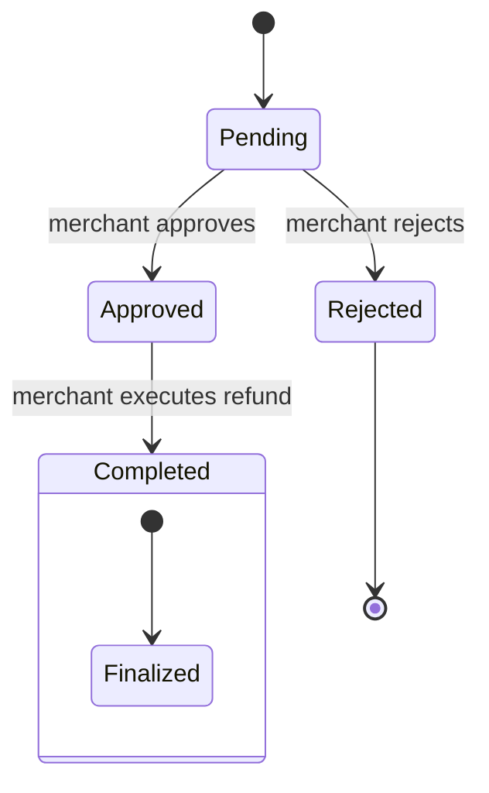

# Refund Lifecycle

## State Diagram

```mermaid
stateDiagram-v2
    [*] --> Pending
    Pending --> Approved : merchant approves
    Pending --> Rejected : merchant rejects
    Approved --> Completed : merchant executes refund
    Rejected --> [*]

    state Completed {
        [*] --> Finalized
    }
```

## Valid transitions

- `Pending` → `Approved`
  - Triggered by the merchant via `approve_refund`
  - Requires refund status to be `Pending`

- `Pending` → `Rejected`
  - Triggered by the merchant via `reject_refund`
  - Requires refund status to be `Pending`

- `Approved` → `Completed`
  - Triggered by the merchant via `execute_refund`
  - Requires refund status to be `Approved`

## Invalid transitions

- `Approved` → `Pending`
- `Completed` → any other state
- `Rejected` → any other state
- `Pending` → `Completed` without prior approval

## Error handling

- `approve_refund` or `reject_refund` called when refund is not `Pending` returns `RefundAlreadyCompleted`
- `execute_refund` called when refund is not `Approved` returns `RefundNotApproved`
- Executing a refund updates the related payment status and records the refund as `Completed`

## Per-payment refund limit

A maximum of **10 refunds** may be initiated against any single payment order. Once this limit is reached, any further call to `initiate_refund` for that `order_id` returns `PaymentError::RefundLimitExceeded` (error code 37).

This limit applies regardless of the status of the individual refund records (Pending, Approved, Rejected, or Completed). Partial refunds each count toward the limit independently.

**Remediation:** No further refunds can be initiated for the payment. If additional funds need to be returned, coordinate off-chain with the payer.
