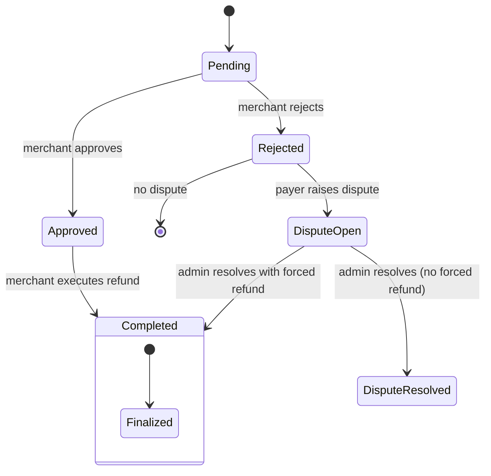

# Refund Lifecycle

## State Diagram


```mermaid
stateDiagram-v2
    [*] --> Pending
    Pending --> Approved : merchant approves
    Pending --> Rejected : merchant rejects
    Approved --> Completed : merchant executes refund
    Rejected --> [*] : no dispute
    Rejected --> DisputeOpen : payer raises dispute
    DisputeOpen --> DisputeResolved : admin resolves (no forced refund)
    DisputeOpen --> Completed : admin resolves with forced refund

    state Completed {
        [*] --> Finalized
    }
```

## Valid transitions

- `Pending` → `Approved`
  - Triggered by the merchant via `approve_refund`
  - Requires refund status to be `Pending`

- `Pending` → `Rejected`
  - Triggered by the merchant via `reject_refund`
  - Requires refund status to be `Pending`

- `Approved` → `Completed`
  - Triggered by the merchant via `execute_refund`
  - Requires refund status to be `Approved`

- `Rejected` → (dispute opened)
  - Triggered by the payer via `raise_dispute`
  - Requires refund status to be `Rejected`
  - Creates a `DisputeRecord` in `Open` state

## Invalid transitions

- `Approved` → `Pending`
- `Completed` → any other state
- `Rejected` → any other state (except via dispute)
- `Pending` → `Completed` without prior approval

## Error handling

- `approve_refund` or `reject_refund` called when refund is not `Pending` returns `RefundAlreadyCompleted`
- `execute_refund` called when refund is not `Approved` returns `RefundNotApproved`
- Executing a refund updates the related payment status and records the refund as `Completed`

## Per-payment refund limit

A maximum of **10 refunds** may be initiated against any single payment order. Once this
limit is reached, any further call to `initiate_refund` for that `order_id` returns
`PaymentError::RefundLimitExceeded` (error code 37).

This limit applies regardless of the status of the individual refund records (Pending,
Approved, Rejected, or Completed). Partial refunds each count toward the limit
independently.

**Remediation:** No further refunds can be initiated for the payment. If additional funds
need to be returned, coordinate off-chain with the payer or use the dispute mechanism.

---

## Dispute Resolution

When a merchant rejects a refund, the payer can escalate by raising a dispute. Disputes
are reviewed and resolved by the contract administrator.

### Lifecycle

```
Rejected refund
      │
      ▼  raise_dispute(caller, dispute_id, refund_id, reason)
  DisputeStatus::Open
      │
      ▼  resolve_dispute(admin, dispute_id, resolution, force_refund)
  DisputeStatus::Resolved
      │
      ├── force_refund=false → dispute closed, no token transfer
      └── force_refund=true  → refund executed immediately (bypasses merchant)
```

### Functions

#### `raise_dispute`

```
raise_dispute(env, caller, dispute_id, refund_id, reason) -> Result<(), PaymentError>
```

| Parameter | Type | Description |
|-----------|------|-------------|
| `caller` | `Address` | Must be the payer of the original payment. Must sign the call. |
| `dispute_id` | `String` | Unique identifier for this dispute (max 64 characters). |
| `refund_id` | `String` | ID of the rejected refund being disputed. |
| `reason` | `String` | Human-readable explanation (max 256 characters). |

**Rules:**
- The caller must be the payer of the original payment; the merchant cannot raise a dispute.
- The refund must be in `Rejected` state. Disputes on `Pending`, `Approved`, or `Completed`
  refunds are rejected with `DisputeRefundNotRejected`.
- Each `dispute_id` must be globally unique.

**Emits:** `lumenflow/dispute_raised` with payload `(dispute_id, refund_id, order_id)`.

**Errors:**

| Code | Name | When |
|------|------|------|
| 50 | `InvalidInput` | `dispute_id` empty/too long or `reason` > 256 chars |
| 111 | `DisputeAlreadyExists` | `dispute_id` already used |
| 30 | `RefundNotFound` | `refund_id` does not exist |
| 112 | `DisputeRefundNotRejected` | Refund is not in `Rejected` state |
| 20 | `PaymentNotFound` | Original payment no longer exists |
| 1 | `Unauthorized` | Caller is not the payment's payer |

---

#### `resolve_dispute`

```
resolve_dispute(env, admin, dispute_id, resolution, force_refund) -> Result<(), PaymentError>
```

| Parameter | Type | Description |
|-----------|------|-------------|
| `admin` | `Address` | Must be the configured contract administrator. |
| `dispute_id` | `String` | ID of the dispute to resolve. |
| `resolution` | `String` | Admin's resolution notes (1–256 characters, required). |
| `force_refund` | `bool` | If `true`, immediately execute the refund amount back to the payer. |

**Rules:**
- Only the admin can resolve disputes.
- A dispute can only be resolved once (`DisputeAlreadyResolved` thereafter).
- When `force_refund=true`, the refund amount is transferred from the merchant to the payer
  immediately without requiring merchant approval. The refund and payment records are updated
  accordingly. The token transfer follows the checks-effects-interactions pattern.

**Emits:** `lumenflow/dispute_resolved` with payload `(dispute_id, resolution, force_refund)`.

**Errors:**

| Code | Name | When |
|------|------|------|
| 1 | `Unauthorized` | Caller is not the admin |
| 110 | `DisputeNotFound` | `dispute_id` does not exist |
| 113 | `DisputeAlreadyResolved` | Dispute is already in `Resolved` state |
| 30 | `RefundNotFound` | Referenced refund no longer exists (only when `force_refund=true`) |
| 20 | `PaymentNotFound` | Referenced payment no longer exists (only when `force_refund=true`) |

---

#### `get_dispute`

```
get_dispute(env, dispute_id) -> Result<DisputeRecord, PaymentError>
```

Returns the full `DisputeRecord` for the given `dispute_id`. Public — no auth required.

---

### DisputeRecord fields

| Field | Type | Description |
|-------|------|-------------|
| `dispute_id` | `String` | Unique dispute identifier |
| `refund_id` | `String` | The rejected refund this dispute refers to |
| `order_id` | `String` | The original payment order |
| `initiator` | `Address` | Payer who raised the dispute |
| `reason` | `String` | Payer's explanation |
| `status` | `DisputeStatus` | `Open` or `Resolved` |
| `resolution` | `Option<String>` | Admin's resolution notes (set on resolve) |
| `created_at` | `u64` | Unix timestamp when dispute was raised |

### CLI examples

```bash
# Raise a dispute on a rejected refund
stellar contract invoke --id $CONTRACT_ID --source-account $PAYER_KEY --network $NETWORK \
  -- raise_dispute \
  --caller $PAYER_ADDR \
  --dispute_id "DISPUTE_001" \
  --refund_id "REFUND_001" \
  --reason "Goods not received, refund unfairly rejected"

# Resolve a dispute without forced refund
stellar contract invoke --id $CONTRACT_ID --source-account $ADMIN_KEY --network $NETWORK \
  -- resolve_dispute \
  --admin $ADMIN_ADDR \
  --dispute_id "DISPUTE_001" \
  --resolution "Evidence reviewed; merchant provided proof of delivery" \
  --force_refund false

# Resolve a dispute and force a refund
stellar contract invoke --id $CONTRACT_ID --source-account $ADMIN_KEY --network $NETWORK \
  -- resolve_dispute \
  --admin $ADMIN_ADDR \
  --dispute_id "DISPUTE_001" \
  --resolution "Payer's claim upheld; forced refund issued" \
  --force_refund true

# Get dispute details
stellar contract invoke --id $CONTRACT_ID --source-account $PAYER_KEY --network $NETWORK \
  -- get_dispute \
  --dispute_id "DISPUTE_001"
```

---

## Recovering an interrupted refund

A client that drives a refund through `initiate_refund → approve_refund →
execute_refund` can be interrupted between calls — or *during* a call, where the
transaction lands on-chain but the client only sees a dropped connection. The
refund is then stuck in `Pending` or `Approved`.

The TypeScript SDK exposes `recoverRefund` to reconcile against the
authoritative on-chain record and resume from wherever the refund actually is:

```ts
import { recoverRefund, RefundRecoveryError } from '@lumenflow/sdk';

const result = await recoverRefund(ops, {
  refundId: 'REFUND_001',
  orderId:  'ORDER_001',
  amount:   1000n,
  reason:   'customer request',
  caller:   merchantAddress, // authorised to initiate + approve
  // targetPhase: 'executed' (default) | 'approved' | 'initiated'
});
// result.finalStatus === 'Completed'
// result.stepsApplied lists the calls this run actually made
```

Guarantees:

| On-chain state on entry | Behaviour |
|-------------------------|-----------|
| Refund missing | `initiate_refund`, then continues |
| `Pending` | `approve_refund`, then `execute_refund` |
| `Approved` | `execute_refund` |
| `Completed` | no-op (`alreadyComplete: true`) |
| `Rejected` / `Disputed` | throws `RefundRecoveryError` — never auto-overridden; use the dispute flow |

After any failed step the routine **re-reads on-chain state** before retrying, so
a transaction that committed despite a client-side network error is recognised
and not re-submitted. Transient errors are retried with a per-step budget;
deterministic contract errors abort immediately. The routine is idempotent —
running it repeatedly converges to the same result.
